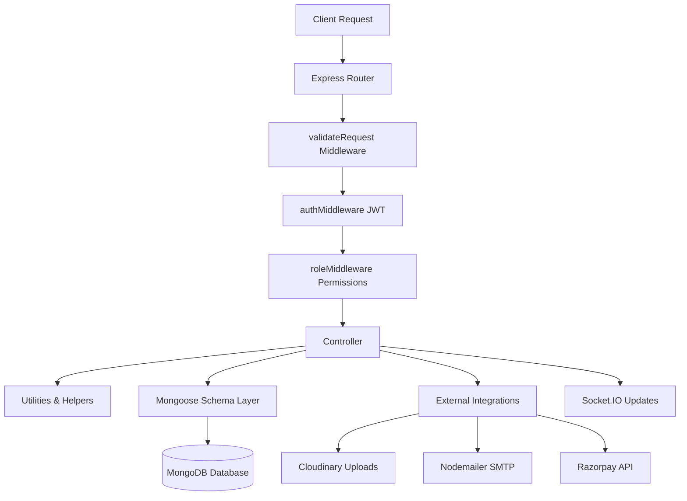

# Backend Project Proposal: SportSync Arena

---

## Introduction
I built the backend of SportSync Arena to handle the database management, payment verifications, bracket scheduling algorithms, and real-time messaging required to run collegiate sports tournaments. My main focus was on building a secure, role-restricted server that keeps tournament brackets in sync and handles monetary transactions safely. This document details the server architecture, database schemas, and service integrations I developed for the project.

---

## Backend Overview
The backend is built as a REST API using **Node.js** and **Express.js (v5.2.1)**. It communicates with a **MongoDB** database via Mongoose, handles real-time alerts through **Socket.IO**, uploads media to **Cloudinary**, sends verification emails using **Nodemailer**, and integrates with the **Razorpay SDK** to process digital payments. 

To keep performance smooth, the server uses a modular design, grouping routes, controllers, database models, and custom validation middleware into separate directories.

---

## Objectives
When building the server, I focused on these core goals:
* **Securing Private Endpoints**: Implement route guards that check JWT tokens and restrict access based on user roles (`admin`, `organizer`, `coach`, `player`, `sponsor`).
* **Safe Payment Processing**: Validate Razorpay orders and confirm transaction signatures using cryptographic hashing before updating database records.
* **Automated Tournament Progressions**: Build bracket logic that automatically declares winners, advances teams, and resolves prize pools when matches end.
* **Real-time Event Broadcasting**: Send match score updates and user-specific alerts immediately over WebSockets.
* **Resilient Database Operations**: Make sure the server can handle environments without replica sets, falling back gracefully during local development.

---

## Scope
The backend code covers:
* **Authentication & Profiles**: Registration, OTP generation and validation, password resets, location coords tracking, and profile updates.
* **Tournament Administration**: Category setups, venue availability checking, bracket round management, and organizer configurations.
* **Team Operations**: Roster registration, captain delegations, player joining fees, and member invite management.
* **Bracket Scheduling**: Automated single-elimination matchups, score recording, and winner resolutions.
* **Financial Auditing**: Razorpay integration, transaction histories, and manual payment overrides for administrators.
* **Real-time Alerts**: Custom notifications models and socket listeners.

---

## Architecture
The server follows a layered controller-service pattern. When a request hits the server, it passes through the routing layer, runs through express-validator checks, checks JWT headers, and then triggers the controller to perform database changes or communicate with external APIs (like Razorpay or Cloudinary).



---

## Folder Structure
I structured the backend code to keep route mappings separate from business logic:

* **`config/`**: Third-party service credentials and configurations (Cloudinary initialization and Nodemailer SMTP transporter setup).
* **`controllers/`**: JS files that process requests, execute logic, and return responses.
* **`middleware/`**: Authentication checks, role filters, upload limits, and MongoDB ID validations.
* **`models/`**: Mongoose schemas mapping database structures.
* **`routes/`**: Route definitions matching URL paths to controllers.
* **`uploads/`**: A temporary folder to store files during processing.
* **`utils/`**: Shared backend code, including bracket calculators and prize distributors.
* **`validators/`**: Validation schemas matching the fields expected in API payloads.
* **`server.js`**: Initializer script that binds routes, starts the HTTP server, and sets up Socket.IO.

---

## API Design
The REST API uses clean routes and standard HTTP status codes:
* **`/api/auth`**: Handle register, login, OTP checks, and password resets.
* **`/api/profile`**: Handle profile fetches and updates (accepts multipart form data).
* **`/api/teams`**: Handle creation, roster list, joins, and approvals.
* **`/api/tournaments`**: Handle public tournament listings, creations, and editing.
* **`/api/matches`**: Handle matchups creation and score entries.
* **`/api/payments`**: Handle Razorpay order creations and verification.
* **`/api/prize-distributions`**: Handle admin payouts audit logs.

---

## Database Design
I chose MongoDB because its document model fits sports data well—teams have arrays of players, and tournaments have arrays of team references. I used Mongoose references (`ObjectId`) to link related documents:

* A **User** can create multiple **Teams** (as captain) and multiple **Tournaments** (as organizer).
* A **Team** has players (referencing the User collection) and belongs to a specific **Sport**.
* A **Tournament** links to a **Sport**, a **Venue**, and holds a list of participating **Teams**.
* A **Match** references the **Tournament**, the two playing **Teams**, and the **Venue**.
* A **Transaction** stores payment logs, referencing the **User** and **Tournament** involved.

---

## Models
Below are the Mongoose schemas I designed to structure the database:

* **`User`**: Stores credentials, age, gender, verification codes, location, roles, and a profile image link.
* **`Tournament`**: Tracks details, rules, sport/venue links, start/end dates, winner/runner-up teams, and creator ID.
* **`Team`**: Tracks the team name, sport, captain, player roster (with pending/approved statuses), and player joining fee.
* **`Match`**: Tracks the round number, playing teams, scores, match date/time, venue link, and winner.
* **`Transaction`**: Logs the amount, purpose (join fee or tournament registration fee), Razorpay order/payment IDs, signature, and status (created, paid, failed).
* **`PrizeDistribution`**: Audits tournament distributions, logging team details, sponsor details, individual player shares, and timestamps.
* **`EmailOtp`**: Stores temporary signup verification codes and expiration timestamps.
* **`Notification`**: Stores user-specific alerts, types, and read statuses.
* **`Venue`** & **`Sport`**: Simple collections tracking category names and locations.

---

## Middleware
I wrote several middleware functions to validate requests and protect routes:
* **`authMiddleware.js`**: Pulls the token from the request headers, verifies it, and attaches the user's metadata to the request object.
* **`roleMiddleware.js`**: Checks if the user's role is allowed to access the route. If not, it blocks the request.
* **`upload.js`**: Configures Multer to accept image uploads, assigning a random name to the file and capping file sizes at 20MB.
* **`validateObjectId.js`**: Validates MongoDB ObjectId parameters in routes to prevent database errors.
* **`validateRequest.js`**: Checks for validation errors from express-validator. If any exist, it returns a `400 Bad Request` status with the error list.

---

## Controllers
The controllers act as coordinators between route parameters and the database:
* **`authController.js`**: Manages signup OTPs, logins, phone verification states, and password recovery steps.
* **`matchController.js`**: Handles scheduling, and triggers round advancement checks when match results are saved.
* **`paymentController.js`**: Instantiates Razorpay orders, registers pending transaction documents, and verifies HMAC-SHA256 signatures.
* **`teamController.js`**: Coordinates roster joins, captain approvals, and team deactivations.
* **`tournamentController.js`**: Coordinates event creations, edit validations, and details formatting.

---

## Authentication
Authentication is managed via signed JSON Web Tokens (JWT):
* **Sign-up validation**: Users register with verified email addresses. The email is confirmed using a 6-digit OTP code sent via SMTP, which expires after 5 minutes.
* **JWT generation**: On login, the server signs a JWT containing the user's ID and role, which the client stores locally and sends in headers.
* **Password hashing**: Credentials are encrypted using `bcryptjs` with a cost factor of 10. Cleartext passwords are never stored.

---

## Authorization
Authorization is managed using role checks. The `role` field on the user document determines which routes they can access:
* **Admins** have access to all routes, including manual payment overrides and user listings.
* **Organizers** can create tournaments and schedule matches, but cannot access player-only routes.
* **Coaches** can create teams and configure joining fees.
* **Players** can join teams and view their registrations.
* **Sponsors** can access the sponsor dashboard and campaign analytics.

---

## Payment Flow
I integrated Razorpay to automate payments for registrations and team join fees:
1. **Order Initiation**: The user initiates a payment. The controller contacts the Razorpay API to create an order, returning the order ID to the client and saving a pending transaction to the database.
2. **Signature Verification**: After the user pays, the client sends back the order ID, payment ID, and signature. The controller verifies the signature using HMAC-SHA256 and the server's private key:

```javascript
const crypto = require("crypto");
const body = razorpay_order_id + "|" + razorpay_payment_id;
const expectedSignature = crypto
  .createHmac("sha256", process.env.RAZORPAY_KEY_SECRET)
  .update(body.toString())
  .digest("hex");

const isAuthentic = expectedSignature === razorpay_signature;
```
If the signature is verified, the transaction status is updated to `paid` and the registration status is updated in the database.

---

## Email Service
I used Nodemailer to configure an SMTP transporter inside `email.js`. The service sends formatted HTML emails for key events:
* **Verification OTP**: Sent during registration to verify new email addresses.
* **Password Reset**: Dispatches reset codes to users who request them.
* **Welcome Email**: Sent automatically once a user's account is verified.
* **Registration confirmation**: Sent when a team registers for a tournament.

---

## File Upload
Profile image uploads are handled using a temporary-to-cloud upload pipeline:
1. **Local storage**: Multer receives the file and saves it temporarily to the `/uploads` directory, validating that the file is an image.
2. **Cloud storage**: The controller uploads the file to Cloudinary, saving it in a specific folder with transformations applied (like scaling it to 500x500px).
3. **Cleanup**: Once Cloudinary returns the secure URL, the controller deletes the temporary local file using `fs.unlinkSync()` to keep the server's disk clean.

---

## Security
I implemented several security practices to protect user data:
* **CORS policy**: Configured CORS to restrict requests to the frontend URL (`http://localhost:5173`).
* **Route Guards**: Critical endpoints are protected by authentication and role middleware.
* **Password Hashing**: Encrypts password credentials before saving them to the database.
* **File Upload Filters**: Restricts file uploads to images only and caps sizes at 20MB.

---

## Error Handling
I configured a global error handler middleware in `server.js` to catch errors and return clean JSON responses:
* **Mongoose Cast Errors**: Catches invalid ObjectId queries and returns a `400 Bad Request` status.
* **Validation Errors**: Returns validation error lists from express-validator as JSON.
* **Duplicate Index Errors**: Catches duplicate entries (like registering with an existing email) and returns an error message.
* **Uncaught Exceptions**: Logs errors to the console and returns a generic `500 Internal Server Error` status to prevent server crashes.

---

## Challenges Faced
* **MongoDB Transactions on Standalone Instances**: Mongoose transactions require replica sets to work. When developing locally on a standalone MongoDB instance, transactions would fail. I solved this by adding a retry helper inside `prizeDistributionHelper.js`. If a transaction error is caught, the helper retries the distribution without a session, allowing local development to work seamlessly.
* **Managing Standings and Payouts**: I needed to make sure match scores couldn't be edited once prize distribution was complete. I added a verification step in the match result update controller that checks the `PrizeDistribution` collection. If a distribution record exists for the tournament, updates are blocked, locking the final standings.

---

## Future Improvements
* **Redis Caching**: Add a Redis cache to store match brackets and leaderboards, reducing database queries during tournaments.
* **Winston Logging**: Replace console logs with Winston to support structured logging, file rotations, and logging levels.
* **Double Elimination Brackets**: Extend the bracket calculator to support double-elimination and round-robin tournament formats.

---

## Conclusion
Building this backend taught me a lot about coordinating payments, real-time sync, and database validation. By combining Express REST endpoints with Socket.IO alerts, Razorpay checkouts, and transactional prize distribution logic, I built a server that can manage tournament bracket progressions reliably.

---
