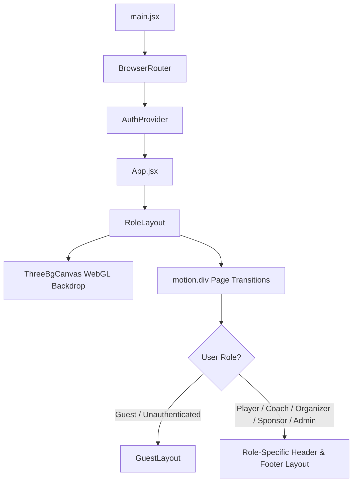
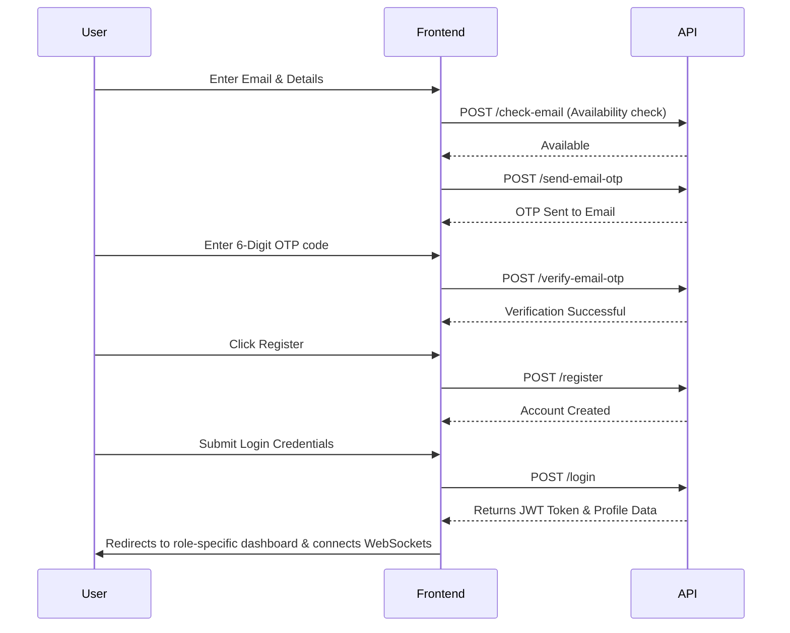

# Frontend Project Proposal: SportSync Arena

---

## Introduction
I built the frontend of SportSync Arena to solve a common problem in college sports: coordinating tournaments is usually a mess of spreadsheets, email threads, and manual cash collections. By building a unified web app, I wanted to give players, coaches, organizers, and sponsors a single place to register, schedule matches, track scores, and handle payments. This document outlines how I designed and structured the client-side of the application.

---

## Project Overview
SportSync Arena is a role-based sports management web application. The frontend is designed to change its layout and navigation menu dynamically depending on who logs in. 

If a student logs in as a player, they see their registered teams and matches. If they log in as a coach, they can approve players and set join fees. Organizers get brackets and scheduling tools, while sponsors can track their budget and campaigns. For anyone visiting the site without an account, it serves as a public hub to check schedules, results, and leaderboards.

---

## Objectives
When I started designing the frontend, I had a few clear goals in mind:
* **Dynamic Role layouts**: Avoid building separate apps for different roles. Instead, I wanted a single app that checks the user's role and renders the appropriate dashboard layouts.
* **Instant visual feedback**: Keep bracket updates and notifications immediate through WebSockets so users don't have to keep refreshing.
* **Easy payment checkout**: Integrate Razorpay directly into user actions, like paying tournament registration or team joining fees, without jarring redirections.
* **Smooth, premium user experience**: Use subtle animations, 3D backgrounds, and interactive cards to make the app feel alive and polished.
* **Fast load times**: Split up heavier dashboard components so they only load when needed, using placeholders to prevent layout shifts.

---

## Scope
The frontend code handles the following:
* **Interactive Landing & Info Pages**: Shows tournament statistics counters, upcoming matches, schedules, venue details, and FAQs.
* **Onboarding & Authentication Forms**: Login, registration, password recovery, and email OTP verification widgets.
* **Role-Based Portals**: Custom workspaces for players, coaches, event organizers, sponsors, and system admins.
* **Tournament & Match UI**: Visual round-by-round knockout brackets, score update forms, and participant registers.
* **Team Management panels**: Interfaces to create teams, configure player joining fees, and approve roster applications.
* **Notification Widgets**: Real-time notifications dropdown menu inside the header navigation.

---

## Frontend Architecture
The app is built as a Single Page Application using **React 18** and **Vite**. 

At the core, everything is wrapped in `BrowserRouter` and an `AuthProvider` context. When a route changes, `RoleLayout` checks the authentication state and loads the role-specific header and footer. Inside `RoleLayout`, I added two global features:
1. **ThreeBgCanvas**: A custom WebGL backdrop that renders dynamic sports pitch lines, spotlights, or tournament brackets depending on which page the user is currently browsing.
2. **Page Transitions**: Framer Motion handles page entry and exit animations globally, smoothing out navigation.

---

## Folder Structure
I organized the `src/` directory to separate global configurations, reusable components, and role-specific screens:

* **`adminside/`**: Views and styles specifically for administrative controls (like managing venues, sports categories, and global transactions).
* **`component/`**: Header and footer components, separated into folders by role (e.g. `headers/PlayerHeader.jsx`, `footers/CoachFooter.jsx`).
* **`components/`**: Reusable UI elements, including dynamic loading skeletons and profile sub-sections.
* **`context/`**: Contains `AuthContext.jsx` to share the current user status, JWT token, and login/logout functions globally.
* **`layouts/`**: Layout wrappers that bind the appropriate headers and footers to the screen content.
* **`routes/`**: Route guard components that redirect unauthorized users.
* **`screen/`**: View files for the main application screens (like Home, Profile, Login, and Tournament Details).
* **`services/`**: Network order setup scripts, specifically dynamic loading of the Razorpay checkout SDK.
* **`static/`**: Clean CSS sheets for each page. Keeping styles separate from logic makes the JS files easier to read.
* **`utils/`**: Shared helpers, including the Axios configuration instance, socket connection, and form validation utilities.

---

## UI Design Decisions
I wanted the interface to look engaging and clean. I avoided using styling frameworks like TailwindCSS to keep complete control over the layout and avoid bloated HTML. Instead, I used standard CSS variables in `App.css` to build a custom design system.

### Variables & Tokens
The app supports both light and dark mode colors. By default, the root html element sets light values, but I configured dark mode style selectors (using `:root[data-theme="dark"]`) to toggle variables seamlessly.

* **Primary Color (`--primary`)**: Set to `#0F4C81` (classic sports blue) to keep the app looking professional and cohesive.
* **Glassmorphism (`--glass-bg` / `--glass-border`)**: I used semi-translucent background cards with backdrop filters for overlay panels, dropdowns, and modals to give the interface depth.
* **Interactive Tilt Cards (`TiltCard.jsx`)**: I wrote a custom hook that tracks mouse movements over dashboard cards to scale them up slightly and tilt them in 3D space, drawing a radial light sweep overlay.

---

## Routing
I used React Router DOM v6. To protect private pages, I created three route guard wrappers:
1. **`AdminRoute`**: Redirects anyone who is not an administrator to the homepage or login page.
2. **`NonOrganizerRoute`**: Blocks users registered as organizers from entering player or coach-specific workspaces, like team creation or registration forms.
3. **`AdminOrOrganizerRoute`**: Allows both admins and organizers to access match setups, registrations checklists, and dashboard analytics.

---

## Components
I divided components into global layout organizers, visual widgets, and loading placeholders:
* **`ThreeBgCanvas`**: Renders particle configurations and outlines (like soccer pitch markings, sports trophies, or bracket frames) using Three.js, matching the page the user is currently on.
* **`TiltCard`**: Applies perspective transitions and sheen filters to statistic containers on mouse hover.
* **Loading Skeletons**: Rather than using a generic loading spinner, I built separate skeletons for tables, match lists, forms, and profiles. When data is fetching, the skeleton mimics the card shapes, preventing layout shifting.
* **Navigation Headers**: Dropdowns categorized into sections like "My Stuff" (for custom teams and registrations) and "Explore" (for leaderboards and gallery) to keep navigation clean.

---

## State Management
To handle different data types efficiently, I split state management into three layers:
1. **Global Auth State (`AuthContext`)**: Stores the active user profile, JWT token, and socket registration state.
2. **Client-Side Cache (`sessionStorage`)**: I wrote a caching helper inside the Axios wrapper that saves GET payloads for 5 minutes. If a user toggles back and forth between screens, the app pulls from the cache rather than querying the backend repeatedly.
3. **Local UI State (`useState`)**: Tracks page-specific parameters like active tabs, modal states, form errors, search inputs, and filters.

---

## API Communication
All REST API requests run through a centralized Axios instance configured in `axiosConfig.js`:
* **Authorization Headers**: A request interceptor automatically retrieves the token from `localStorage` and appends it as a `Bearer` token to the headers.
* **Automatic Session Cleanup**: If the server returns a `401 Unauthorized` response (indicating the token expired or is invalid), the interceptor clears the local token storage and redirects the user to `/login`.
* **File Upload Formats**: When uploading files (like profile photos), the interceptor deletes the default `Content-Type` header, letting the browser automatically set the correct boundary for multipart data.

---

## Authentication Flow
From the user's perspective, the registration and login flows are secured using email verification and multi-step verification:

---

## Major Features
* **Role-Adaptive Workspaces**: Dashboards change structure based on roles. Sponsors view budget statistics, coaches manage player lists, and players track team standings.
* **Razorpay Checkout**: Seamless payment gateways for team signups, player joining fees, and tournament creation fees, with client-side signature validations.
* **knockout Bracket UI**: Real-time bracket layouts displaying team match-ups, scores, and round progressions.
* **Interactive Analytics**: Graphical charts mapping user registration numbers and sponsorship distribution ratios using Recharts and Chart.js.

---

## Challenges Faced
* **WebGL Context Crashes**: When navigating between pages, Three.js was not automatically cleaning up its rendering contexts, causing memory leaks and browser crashes. I solved this by disposing of geometries, materials, and rendering frame animations in the cleanup hook of `useEffect`.
* **Maintaining UI State on Socket Disconnect**: If a user's internet drops temporarily, the WebSocket disconnects, leaving the real-time dashboard stale. I built a hybrid fallback that checks the socket status. If it's offline, the app switches to a 10-second REST polling loop to fetch dashboard updates.

---

## Future Improvements
* **Drag-and-Drop Tournament Brackets**: Allow organizers to manage tournament matchups visually by dragging team cards into bracket slots.
* **Offline Bracket View**: Cache tournament brackets in local storage so users can check schedules and previous scores without an active internet connection.
* **Header Theme Switcher**: Add a button to the navbar to let users manually switch between light and dark mode.

---

## Conclusion
Building this frontend showed me how much work goes into coordinating role-based workflows and real-time updates. By combining custom CSS styling with Three.js graphics, Framer Motion animations, and socket-driven alerts, I built an interface that is visually engaging, easy to navigate, and responsive on all devices.

---
